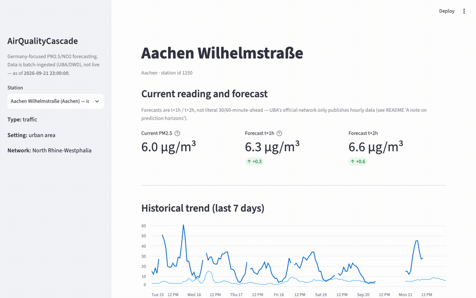
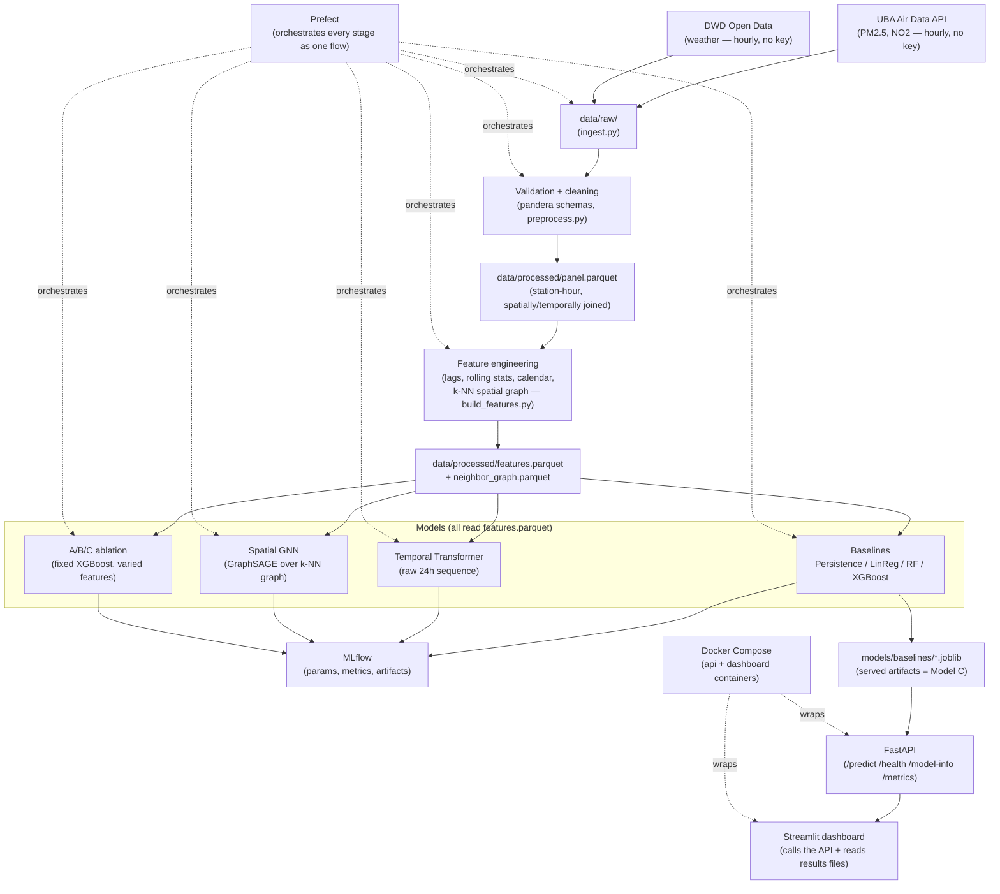

# AirQualityCascade

Germany-focused short-term air-quality forecasting: PM2.5/NO2 forecasts at
**t+1h and t+2h** from UBA (pollution) and DWD (weather) open hourly data.

**Research question:** does spatial information from neighboring monitoring
stations improve short-term forecasting, compared to a station forecasting
from its own history and local weather alone?

**Answer** (see [Spatial experiment](#spatial-experiment)): yes, measurably —
but *how* you add it matters. A simple engineered neighbor-mean feature beats
a 2-layer GraphSAGE GNN learning the aggregation from scratch, at this
dataset's scale. This is a specific finding about this GNN, this dataset, and
this architecture — not a general claim that GNNs are worse at spatial tasks.

> All 11 development phases complete: ingestion → validated features →
> baseline/Transformer/GNN/ablation models → MLflow tracking → Prefect
> orchestration → FastAPI + Streamlit serving → Docker → CI. Every number
> below is measured from this repo's own scripts and output files, not
> invented.



*Real screenshots of the live Streamlit dashboard, backed by the FastAPI
service — forecast + trend, neighboring-station table, model comparison,
station map, then switching to the hardest station in the test set
(Halle/Paracelsusstr.) and its actual ~250 µg/m³ spike history.*

## Data

| Source | What | Resolution | License |
|---|---|---|---|
| [UBA Air Data API v3](https://www.umweltbundesamt.de/api/air_data/v3) | PM2.5, NO2 and other pollutants at German stations | **Hourly** (verified live — no sub-hourly values exist) | Datenlizenz Deutschland – Namensnennung 2.0 |
| [DWD Open Data (CDC)](https://opendata.dwd.de/climate_environment/CDC/observations_germany/climate/) | Temperature, wind, pressure, precipitation, humidity | Hourly | CC BY 4.0 |

No API key required for either. Full field docs:
[`configs/data_sources.yaml`](configs/data_sources.yaml).

**On prediction horizons**: the original brief targeted 30-/60-minute
forecasts. UBA's network only publishes hourly aggregates (confirmed by
querying live data — no finer granularity exists), so interpolating to
synthesize 30-minute points would misrepresent the data. This project
forecasts **t+1h / t+2h** instead — the finest horizon the real data
actually supports.

**Scale** (90-day window, 2026-06-24 → 2026-09-21): 315 PM2.5 stations,
664,791 hourly observations pulled (97.7% of theoretical max), 251/315
stations have a same-pollutant neighbor within 25km. Full stats:
`data/raw/manifest.json`, reproducible via
[`scripts/ingest.py`](scripts/ingest.py).

Every raw table is validated against a
[pandera](https://pandera.readthedocs.io/) schema before cleaning
([`src/aqcascade/validation/schemas.py`](src/aqcascade/validation/schemas.py))
— this caught a real bug where DWD's raw station-level pressure column was
mapped instead of sea-level pressure, producing physically impossible ~700
hPa readings at high-elevation stations. Missing values are never silently
filled at this stage; every `NaN` is carried forward for feature engineering
to handle explicitly.

## Architecture



Only the baseline XGBoost model ("Model C") is served via the API — the
Transformer and GNN exist to answer the research question, not for
production serving, since a single-station prediction request doesn't have
the other 314 stations' simultaneous data a GNN snapshot needs.

## Methodology

**Leakage prevention**: for a prediction at time T, only data at-or-before T
is used. Splits are strictly chronological (train on the earliest period,
test on the most recent — never random). Guards live in
[`src/aqcascade/validation/leakage.py`](src/aqcascade/validation/leakage.py)
and gate every split via
[`src/aqcascade/evaluation/split.py`](src/aqcascade/evaluation/split.py).
[`tests/data/test_feature_leakage.py`](tests/data/test_feature_leakage.py)
runs the real feature-building code on a synthetic panel with a spike
planted at a future hour and asserts no feature sees it early, with a
positive control proving the check isn't vacuous.

**Features** (67 columns, 680,400 rows = 315 stations × 2,160 hours,
[`configs/features.yaml`](configs/features.yaml)): pollution history (lags,
rolling stats, rate-of-change), weather (temp/wind/pressure/precipitation),
calendar (hour/day/season, cyclically encoded), and spatial (k=5
nearest same-pollutant neighbors within 100km — mean, count, rate-of-change,
distance).

**Models**: Persistence / Linear Regression / Random Forest / XGBoost
baselines; a Temporal Transformer learning directly from a raw 24h sequence
(no neighbor features, no hand-engineered lags); and a Spatial GNN
(2-layer GraphSAGE over the same k-NN graph) that learns spatial aggregation
instead of consuming a pre-computed neighbor summary.

## Results

Test-split metrics, full breakdown in
`data/processed/{baseline,transformer,gnn}_results.csv`:

| Target | Model | MAE | RMSE | R² |
|---|---|--:|--:|--:|
| PM2.5 t+1h | Persistence | **0.723** | 2.130 | 0.453 |
| PM2.5 t+1h | XGBoost | 0.741 | 1.848 | 0.588 |
| PM2.5 t+1h | GNN | 0.873 | 1.859 | 0.582 |
| PM2.5 t+1h | Transformer | 0.848 | **1.835** | **0.618** |
| PM2.5 t+2h | Persistence | 1.106 | 2.555 | 0.210 |
| PM2.5 t+2h | **XGBoost** | **1.036** | **2.073** | **0.480** |
| NO2 t+1h | **XGBoost** | **2.507** | **4.187** | **0.846** |

Persistence has the *lowest* raw MAE at PM2.5 t+1h (most hours barely
change) but the *worst* R² except itself at t+2h (it structurally can't see
sharp swings coming) — both numbers are real and not in tension, they
measure different things. These baselines mix local/weather/spatial signal
together, so they can't say *why* XGBoost wins — that's the controlled
experiment below.

### Spatial experiment

Holds architecture fixed (XGBoost) and varies only feature access, in
strictly nested tiers
([`src/aqcascade/models/feature_groups.py`](src/aqcascade/models/feature_groups.py)),
plus the GNN retrained on Model B's exact feature scope for a controlled
comparison:

| Target | Model | Features | R² |
|---|---|---|--:|
| PM2.5 t+1h | A — local history only | 54 | 0.541 |
| PM2.5 t+1h | B — A + weather | 63 | 0.560 |
| PM2.5 t+1h | D — B + GNN message passing | 66 | 0.582 |
| PM2.5 t+1h | **C — B + neighbor features** | 69 | **0.588** |
| PM2.5 t+2h | A — local history only | 54 | 0.409 |
| PM2.5 t+2h | B — A + weather | 63 | 0.431 |
| PM2.5 t+2h | D — B + GNN message passing | 66 | 0.447 |
| PM2.5 t+2h | **C — B + neighbor features** | 69 | **0.470** |

R² rises monotonically at every step, both horizons, no reversals — spatial
context is the single largest feature-group contribution measured in this
project. But the GNN (D), despite learning its own aggregation via message
passing, doesn't catch up to simply handing the model a pre-computed
neighbor mean (C). The ranking A < B < D < C holds on both horizons: message
passing strictly helps over no spatial information at all, it just hasn't
closed the gap to the simpler feature at this scale (90 days, 315 stations,
a deliberately simple 2-layer architecture). A larger graph, longer history,
or richer architecture (more layers, attention-based aggregation) are the
natural next experiments — not run here for lack of data to justify the
added complexity.

### Error analysis

Traffic stations are harder to forecast than background stations (mean MAE
0.807 vs 0.722) — consistent with burstier, less autocorrelated PM2.5 near
traffic. Per-station MAE correlates with that station's own outlier rate
(Pearson r = 0.657). Spike classification (train-period 90th percentile
threshold): precision 0.71, recall 0.47 — the model is conservative, right
most of the time it flags a spike but misses more than half of real ones,
a real limitation for an early-warning use case. Full breakdown:
`scripts/error_analysis.py` → `data/processed/error_analysis_*.csv`.

## API

FastAPI service ([`src/aqcascade/api/`](src/aqcascade/api/)) serving the
same XGBoost "Model C" artifact evaluated above — verified byte-for-byte
identical in feature composition to the ablation's Model C. Serves from
batch-ingested data (Phases 1–4), never a live sensor feed; every response
carries `as_of_timestamp` so this is never ambiguous.

```bash
uvicorn aqcascade.api.main:app --port 8010 --app-dir src
```

```bash
curl -X POST http://localhost:8010/predict \
  -H "Content-Type: application/json" \
  -d '{"station_id": 21, "pollutant": "pm25", "horizon_hours": 1}'
```

```json
{
  "station_id": 21, "station_name": "Potsdam-Zentrum", "pollutant": "pm25",
  "predicted_value": 5.9, "model_version": "xgboost-model-c__target_pm25_h1",
  "uncertainty": {"mae": 0.75, "rmse": 1.846, "r2": 0.588,
    "note": "Historical test-set metrics, not a per-prediction confidence interval."}
}
```

Unknown `station_id` → `404`. An untrained (pollutant, horizon) combination
→ `422`. Malformed requests are rejected by Pydantic before reaching the
model. Also: `GET /health`, `GET /model-info`, `GET /metrics`. Interactive
docs at `/docs`. Tested end-to-end in
[`tests/api/test_api.py`](tests/api/test_api.py).

## Dashboard

```bash
uvicorn aqcascade.api.main:app --port 8010 --app-dir src &
PYTHONPATH=src streamlit run app/streamlit/dashboard.py --server.port 8512
```

[`app/streamlit/dashboard.py`](app/streamlit/dashboard.py) calls the live
API for forecasts and reads every other number from this project's own
output files. Station-selectable: current reading + forecast with a spike
alert, 7-day trend, neighboring-station values, weather context, model
comparison table, per-station error stats, and a pydeck map of all 315
stations. Verified live in-browser, including on the single hardest station
identified in error analysis.

## MLOps

**MLflow** — every training script logs params, metrics, a content hash of
the exact feature file used (`dataset_version`), and (for baselines,
Transformer, and GNN) the trained artifact. Verified: **20 runs across 4
experiments** (12 baseline combinations, 1 Transformer, 1 GNN, 6 ablation
runs) actually logged. The 6 ablation runs log params/metrics only, by
design — they compare feature tiers, not produce servable models.

```bash
mlflow ui --backend-store-uri sqlite:///mlruns/mlflow.db
```

**Prefect** — [`src/aqcascade/pipeline/flows.py`](src/aqcascade/pipeline/flows.py)
wraps the existing scripts as tasks in one flow; each task shells out to the
real script rather than reimplementing it. Runs entirely locally, no
server required. Verified with a real, complete ~27-minute end-to-end run,
all tasks `Completed` — the results throughout this README come from that
run.

```bash
python -c "from aqcascade.pipeline.flows import full_pipeline; full_pipeline(skip_ingestion=True)"
```

**Docker** — the image serves the API and dashboard from already-trained
artifacts (never trains), and deliberately ships a subset of dependencies
(no torch/mlflow/prefect at runtime). Built and run for real: `/health` and
`/predict` verified via `curl` through the container, dashboard verified
in-browser through the container network, both matching the non-Docker run
exactly. Image is 1.92GB — larger than ideal because a version-mismatch bug
(loading a joblib-pickled XGBoost 3.4.1 model under 2.1.4 silently produced
a different prediction for the same input) meant the serving image must
match the training XGBoost major version rather than using a slimmer pin.

```bash
docker compose up -d && curl http://localhost:8013/health
```

**CI** — [`.github/workflows/ci.yml`](.github/workflows/ci.yml) runs
`ruff`, `mypy`, and `pytest` on push/PR. It does not retrain models or hit
live APIs. Tests that need real trained models/features `skipif` on their
absence ([`tests/conftest.py`](tests/conftest.py)) — verified locally by
hiding `data/processed`/`models/` and confirming a clean 78 passed / 13
skipped, then restoring them for 91 passed. The workflow itself has not yet
been exercised on a real GitHub Actions runner.

## Reproduction

```bash
# 1. Environment (Python 3.12)
uv venv --python 3.12 && source .venv/bin/activate
uv pip install -e ".[dev]"

# 2. Ingest (writes data/raw/, no API key needed)
python scripts/ingest.py                              # full 90-day pull (~5 min)

# 3-9. Validate/clean, build features, train baselines/Transformer/GNN,
# run the ablation, and run error analysis:
python scripts/preprocess.py
python scripts/build_features.py
python scripts/train_baselines.py      # ~7-14 min
python scripts/train_transformer.py    # ~3 min on Apple Silicon MPS
python scripts/train_gnn.py            # ~1 min on Apple Silicon MPS
python scripts/run_ablation.py         # ~40s
python scripts/error_analysis.py       # ~10s

# --- or run steps 3-9 as one orchestrated Prefect flow: ---
python -c "from aqcascade.pipeline.flows import full_pipeline; full_pipeline(skip_ingestion=True)"

# 10. Inspect tracked runs
mlflow ui --backend-store-uri sqlite:///mlruns/mlflow.db

# 11. Serve directly, or containerized:
uvicorn aqcascade.api.main:app --port 8010 --app-dir src &
PYTHONPATH=src streamlit run app/streamlit/dashboard.py --server.port 8512
docker compose up -d   # api on :8013, dashboard on :8512
```

**macOS**: XGBoost needs the OpenMP runtime — `brew install libomp` before
step 5, or `pip install xgboost` raises `dlopen ... libomp.dylib` on import.

## Limitations

- Forecasts are **t+1h/t+2h**, not literal 30/60-minute-ahead — the real data's finest available resolution.
- Serves batch-ingested data, not a live sensor feed — every response carries `as_of_timestamp`.
- UBA (pollution) and DWD (weather) are different physical station networks; weather is a nearest-station join, not co-located.
- ~15% of DWD precipitation downloads failed despite active station metadata; every station still got at least one other weather parameter.
- This GNN is deliberately simple (2-layer GraphSAGE, single-hour snapshots) and doesn't yet close the gap to simple neighbor-mean features at this scale — see Spatial experiment.
- Spike-classification recall (0.47) is weaker than precision (0.71) — under-flags real spikes more than it over-flags calm periods, a real gap for early-warning use.
- `/predict`'s `uncertainty` field is a historical test-set residual, not a per-prediction confidence interval.
- Model artifacts are joblib-pickled, which is not safe across XGBoost major versions (verified: a materially different prediction resulted). The real fix — `Booster.save_model`'s portable format — wasn't implemented to avoid retraining scope creep.
- Random Forest artifacts are large (95–149MB each) — gitignored, not checked in.
- CI has not been exercised on a real GitHub Actions runner yet.

## License

Code: MIT (see [`LICENSE`](LICENSE)). Data: subject to the UBA and DWD
licenses listed above — this repo does not redistribute raw data.
