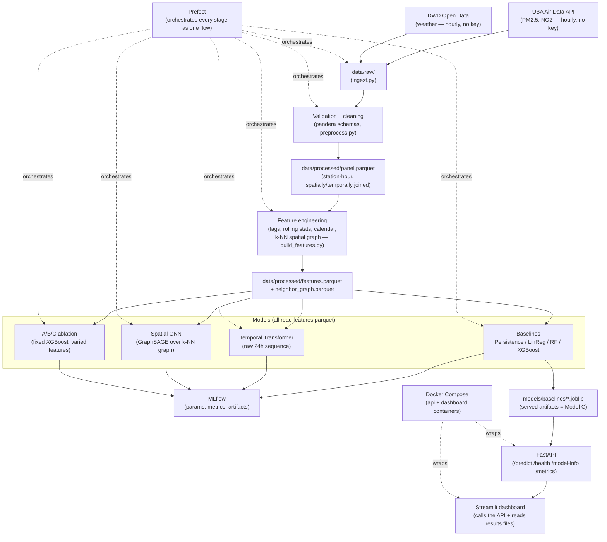

# AirQualityCascade

Germany-focused short-term air-quality forecasting and early-warning system.

**Research question:** does spatial information from neighboring monitoring
stations improve short-term (1–2 hour ahead) air-quality prediction, compared
to a station forecasting from its own history and local weather alone?

> Status: all 11 phases complete — the project's central research question
> has a controlled, honest answer (see "Spatial experiment" below), served
> through a working API and dashboard, with the full pipeline orchestrated,
> tracked, containerized, and CI-checked. No metric, dataset size, or
> result in this file is invented; every number is either measured
> directly or explicitly labeled as not yet measured. Nothing has been
> committed to git — see "Reproduction" to run everything yourself.

## Problem

PM2.5 (fine particulate matter) and NO2 are two of the pollutants Germany's
federal and state environment agencies monitor continuously because both
are linked to real, measurable health outcomes — respiratory and
cardiovascular effects at exposures well below what's visibly "smoggy."
Germany, like the rest of the EU, operates under air-quality thresholds
that are looser than the WHO's 2021 guideline update, which halved the
recommended PM2.5 annual mean from 10 to 5 µg/m³ — a station can comply
with the legal limit while still exceeding the health-based guidance, which
is part of why finer-grained, station-level information (not just "is this
region in compliance") has practical value.

A short-term forecast — "what will PM2.5 look like at this station in the
next one to two hours" — is useful precisely because it's actionable at a
timescale people and institutions can respond to: outdoor exercise
timing, ventilation decisions for schools and care facilities near traffic
corridors, or advance warning for the pollution episodes this project's
own error analysis shows are the hardest to predict (elevated,
traffic-adjacent, volatile). It's a materially different problem from
predicting tomorrow's daily average: the data resolution, the leakage
discipline, and the choice of what "neighboring stations" can and can't
tell a model all follow from operating at the scale of single hours, not
days.

This project asks a specific, falsifiable version of a common assumption
in that setting: does knowing what nearby stations are reporting actually
improve a short-horizon forecast, or is a well-built model of a station's
own history and weather already most of the value? The answer, worked out
under a controlled comparison in ["Spatial experiment"](#spatial-experiment)
below, is a qualified yes — spatial context helps measurably, but *how*
it's incorporated (a simple engineered feature vs. a graph neural network
learning the aggregation itself) turns out to matter as much as whether
it's included at all, which is not the answer either extreme (always use a
GNN, or spatial info doesn't matter) would have predicted in advance.

## Data

### Sources

| Source | What | Resolution | License | Auth |
|---|---|---|---|---|
| [UBA Air Data API v3](https://www.umweltbundesamt.de/api/air_data/v3) | PM2.5, PM10, NO2, O3, SO2 and other pollutants at German monitoring stations | **Hourly** (verified live — no sub-hourly values exist) | Datenlizenz Deutschland – Namensnennung 2.0 | None |
| [DWD Open Data (CDC)](https://opendata.dwd.de/climate_environment/CDC/observations_germany/climate/) | Temperature, wind, pressure, precipitation, humidity at German weather stations | Hourly (10-min/1-min also exist but unused) | CC BY 4.0 | None |

Full endpoint/field documentation: [`configs/data_sources.yaml`](configs/data_sources.yaml).

### A note on prediction horizons

The original brief targeted 30- and 60-minute-ahead forecasts. UBA's official
network publishes **hourly** aggregates only (confirmed by querying live
measurement data — one value per clock hour, no finer granularity available).
Synthesizing 30-minute points via interpolation would misrepresent the data's
actual resolution, so this project instead forecasts **t+1h** and **t+2h**,
the finest horizons the real data actually supports. This is a deliberate,
documented adaptation, not a shortcut.

### Dataset statistics

From the Phase 2 ingestion run (2026-09-22, 90-day window 2026-06-24 → 2026-09-21):

| | |
|---|--:|
| UBA stations ever registered (all networks, all time) | 2,400 |
| UBA stations currently reporting PM2.5 | 315 |
| UBA stations currently reporting NO2 | 375 |
| PM2.5 hourly observations pulled | 664,791 (97.7% of the 315×90×24 theoretical max) |
| NO2 hourly observations pulled | 790,587 |
| PM2.5 value range | 0 – 362 µg/m³ (median 6, mean 6.7); 8 hours nationwide exceeded 200 µg/m³ — rare, localized spikes, not sensor error (isolated to single stations/hours) |
| Explicit nulls / negative values (PM2.5) | 10,874 nulls, 0 negative |
| Duplicate (station, hour) rows | 0 |
| DWD weather stations downloaded (unique) | 668 |
| DWD weather join success rate | ~99% for temperature/wind/pressure, **~85% for precipitation** (see limitation below) |
| Nearest-neighbor distance between PM2.5 stations | median 8.0 km, mean 13.8 km, max 84.6 km |
| PM2.5 stations with a same-pollutant neighbor within 25 km | 251 / 315 (80%) |

These numbers come from `data/raw/manifest.json` and direct inspection of the
downloaded parquet files — see [`scripts/ingest.py`](scripts/ingest.py) to
reproduce. The station-density figures matter for the spatial experiment
later: most stations have at least one PM2.5-reporting neighbor within a
plausible commuting/weather-correlated range.

### Validation & cleaning (Phase 3)

Every raw table is validated against a [pandera](https://pandera.readthedocs.io/)
schema for physical plausibility (not statistical normality — see
[`src/aqcascade/validation/schemas.py`](src/aqcascade/validation/schemas.py))
before any cleaning happens. This caught a real bug: the DWD hourly pressure
file has two columns, "P" (sea-level pressure) and "P0" (raw station-level
pressure) — ingestion initially mapped the wrong one to `pressure_msl_hpa`,
producing physically impossible ~700 hPa "sea-level" readings for the
Zugspitze station. The schema's `[850, 1100] hPa` range check failed exactly
where it should, the bug was traced to Zugspitze's 2956m elevation (~700 hPa
is correct for *station-level* pressure there), fixed in
[`src/aqcascade/ingestion/dwd.py`](src/aqcascade/ingestion/dwd.py), and the
data re-ingested. Full writeup in `configs/data_sources.yaml`.

After validation: deduplication on (station, hour), invalid-timestamp
dropping, and IQR-based outlier *flagging* (never dropping — a real
pollution spike is not an error) via
[`src/aqcascade/preprocessing/clean.py`](src/aqcascade/preprocessing/clean.py).
Weather is then spatially/temporally joined onto the PM2.5 timeline
([`src/aqcascade/preprocessing/align.py`](src/aqcascade/preprocessing/align.py))
into a single station-hour panel at `data/processed/panel.parquet`.

Real results from that run (`data/processed/validation_report.json`):

| | |
|---|--:|
| Panel rows (PM2.5-station-hours) | 664,791 |
| Duplicates / invalid timestamps dropped | 0 / 0 (raw data was already clean) |
| PM2.5 statistical outliers flagged (IQR ×3, not dropped) | 7,725 (1.2%) |
| Missing PM2.5 / NO2 | 1.64% / 5.26% |
| Missing temperature / humidity / wind speed / wind direction | 0.63% / 0.68% / 1.62% / 1.59% |
| Missing pressure / precipitation | 6.4% / 15.3% (reflects the DWD download-gap above) |

No missing value is filled in at this stage — every percentage above is an
honest count of `NaN`s carried into `data/processed/panel.parquet`, left for
Phase 4 feature engineering to handle explicitly (e.g. via lag features that
are naturally NaN-tolerant), not silently imputed here.

## Architecture



Two things this diagram is deliberately explicit about, because they're
easy to assume incorrectly from a glance: **only the baseline models'
artifacts are served** (the API serves XGBoost "Model C" specifically —
the Transformer and GNN exist for the research question, not for
production serving, since a single-station prediction request doesn't
have the other 314 stations' simultaneous data a GNN snapshot needs); and
**Prefect orchestrates, it doesn't replace, the underlying scripts** —
every box it touches is a real, independently-runnable script with its
own tests, not logic that only exists inside a flow definition.

## Methodology

### Temporal leakage prevention

For a prediction made at time T, only observations at or before T are used
as features. Train/validation/test splits are chronological (train on the
earliest period, validate on the next, test on the most recent) — never
random — because random splitting on time series lets the model see the
future during training. Reusable guards live in
[`src/aqcascade/validation/leakage.py`](src/aqcascade/validation/leakage.py):
`assert_chronological_split` (rejects any train/val/test overlap in time),
`assert_feature_not_from_future` (a single feature can't be timestamped
after the prediction instant), and `assert_horizon_target_is_future` (a
training target must sit exactly `horizon` after its feature cutoff — catches
off-by-one errors in lag/shift code). These are exercised by
[`tests/data/test_leakage.py`](tests/data/test_leakage.py) and now actually
gate every split via
[`src/aqcascade/evaluation/split.py`](src/aqcascade/evaluation/split.py)'s
`chronological_split`, used to train the Phase 5 baselines below — a bug in
the split logic would fail loudly, not just in a test.

### Feature engineering (Phase 4)

Before any lag/rolling feature is computed, the panel is reindexed onto a
full hourly grid per station
([`src/aqcascade/features/regularize.py`](src/aqcascade/features/regularize.py)):
the raw panel only has rows for hours a station actually reported (97.7%
complete), so a naive `.shift(1)` on that sparse table would silently pull
in the wrong hour across a gap. Regularizing first (leaving genuinely absent
hours as explicit `NaN`, never fabricated) makes every later shift/rolling
operation calendar-correct — 315 stations × 2,160 hours = 680,400 grid rows.

Feature groups, all computed strictly from data at-or-before the feature
timestamp T (configurable via
[`configs/features.yaml`](configs/features.yaml)):

- **Pollution history** ([`pollution.py`](src/aqcascade/features/pollution.py)): lags at 1/2/3/6/12/24h, rolling mean/std/max/min over 3/6/24h windows, 1h rate-of-change, and a 6h trend — for both PM2.5 and NO2.
- **Weather** ([`weather.py`](src/aqcascade/features/weather.py)): the raw joined values, plus wind direction as sin/cos (it's circular — 359° and 1° are neighbors, not opposites) and 3h pressure tendency.
- **Temporal** ([`calendar.py`](src/aqcascade/features/calendar.py)): hour, day-of-week, weekend flag, month, meteorological season, and cyclical sin/cos encodings — all derived from the feature timestamp T, never the target time (T+horizon is fully determined by T and the fixed horizon, so this can't leak).
- **Spatial** ([`spatial.py`](src/aqcascade/features/spatial.py)): for each station's k=5 nearest same-pollutant neighbors (haversine distance, ≤100km — the same graph Phase 7's GNN will reuse), the neighbor mean, neighbor count, neighbor rate-of-change, and nearest-neighbor distance. Neighbor values are read at the *same* timestamp T as the target station — never a leakage risk, exactly like the weather join.
- **Targets** ([`targets.py`](src/aqcascade/features/targets.py)): `target_pm25_h1`, `target_pm25_h2`, `target_no2_h1` — the only place in the pipeline allowed to look into the future, by construction.

Real results from `scripts/build_features.py` (`data/processed/features_report.json`):

| | |
|---|--:|
| Feature table rows | 680,400 (315 stations × 2,160 hours) |
| Feature columns | 67 |
| Neighbor graph edges | 1,568 (of a possible 1,575 = 315×5; every station got ≥1 neighbor within 100km) |
| Missing target (PM2.5, t+1h / t+2h) | 3.94% / 3.98% |
| Missing target (NO2, t+1h) | 7.48% |

**Leakage verification**: beyond the unit tests for each feature function,
[`tests/data/test_feature_leakage.py`](tests/data/test_feature_leakage.py)
runs the actual production `build_feature_table()` on a synthetic two-station
panel with a distinctive spike planted at one future hour, and asserts no
feature column — own-station or neighbor — ever contains that value before
it occurred, with a positive-control test confirming the target columns *do*
see it at the correct offset (proving the check isn't vacuous).

### Baseline models (Phase 5)

Four models, all evaluated on identical rows per target (same chronological
split, same "must have a valid current value" filter, so the persistence
baseline is never given an easier row set than the others):

1. **Persistence** — predicts "no change" (the most recent observed value). No fitting.
2. **Linear Regression**, median-imputed (`SimpleImputer` fit on the *train split only* — fitting the imputer on val/test statistics would itself leak information about data the model is later evaluated on).
3. **Random Forest** (150 trees, max depth 14), same train-only imputation.
4. **XGBoost** (300 trees, depth 6, lr 0.05) — handles missing values natively, so it sees the real missingness pattern instead of an imputed one.

Split ([`scripts/train_baselines.py`](scripts/train_baselines.py), chronological 70/15/15): train 2026‑06‑24→2026‑08‑25 (466K rows), val 2026‑08‑26→2026‑09‑08 (100K), test 2026‑09‑08→2026‑09‑21 (85K) — the held-out test period is entirely after training and validation in time, never interleaved.

### Temporal Transformer (Phase 6)

The baselines above consume hand-engineered lag/rolling summaries flattened
into one row per prediction. The Transformer
([`src/aqcascade/models/transformer.py`](src/aqcascade/models/transformer.py))
instead learns directly from a raw 24-hour sequence of a station's own
history and weather — a deliberately different methodology, not a rerun of
the same features through a fancier model:

- **Input**: 24-hour window (configurable), 13 channels — current PM2.5/NO2, weather (temp, humidity, wind speed/direction as sin/cos, pressure, precipitation), and calendar (hour/day-of-week as sin/cos) — plus 2 "was this value imputed" mask channels for PM2.5 and precipitation, the two columns with real gaps. **No neighbor/spatial features** — that's the GNN's job (Phase 7) — and no hand-engineered lags: the sequence *is* the history.
- **Architecture**: input projection → sinusoidal positional encoding → 2-layer Transformer encoder (d_model=64, 4 heads) → the *last* timestep's representation → small MLP head → 2 outputs (t+1h, t+2h) trained jointly. No causal mask: since only the last position's representation is ever read out, and nothing exists after it in the window anyway, a mask would restrict earlier positions' attention for zero effect on the output — dead complexity, left out deliberately (see the class docstring for the reasoning).
- **Leakage safety is structural**, not a runtime check: a window for prediction time T is a literal array slice `[T-23, ..., T]` from a chronologically-sorted per-station array — a timestamp after T cannot appear because it doesn't exist yet at that array position.
- 70,114 parameters, trained with Adam (lr 1e-3), early stopping on validation loss. Feature *and* target normalization statistics are computed from the train split only (same train-only discipline as the baselines' imputer).

**A real bug caught before trusting results**: forward-filling missing values only helps when a station has *some* real reading to fill forward from. 17/315 stations never got a successful pressure join at all (see the Phase 2 DWD-download-gap note above) and 46/315 never got precipitation — the original fallback for "still missing after forward-fill" was a flat `0.0`, which for pressure (always ~1000 hPa) is wildly out of distribution and corrupted the training-only normalization stats (mean dropped to 957 hPa, std inflated to 240). Fixed by falling back to each column's own dataset-wide median instead, verified by checking the post-fix stats landed at a physically correct 1017±5 hPa, and locked in with a unit test.

Trained on all 315 stations (Apple Silicon MPS — full logs in
`data/processed/transformer_summary.json`; re-trained during Phase 10's
Prefect pipeline run, see the note on run-to-run variance below):

| Target | MAE | RMSE | R² |
|---|--:|--:|--:|
| PM2.5 t+1h | 0.848 | 1.835 | 0.618 |
| PM2.5 t+2h | 1.154 | 2.179 | 0.461 |

**Honest comparison against the Phase 5 XGBoost baseline** (which had the
full feature set — local history + weather + neighbors — while the
Transformer has only local history + weather):

| Target | Model | MAE | RMSE | R² |
|---|---|--:|--:|--:|
| PM2.5 t+1h | XGBoost (full features) | **0.741** | 1.848 | 0.588 |
| PM2.5 t+1h | Transformer (no neighbors) | 0.848 | **1.835** | **0.618** |
| PM2.5 t+2h | XGBoost (full features) | **1.036** | **2.073** | **0.480** |
| PM2.5 t+2h | Transformer (no neighbors) | 1.154 | 2.179 | 0.461 |

Genuinely mixed, not a clean win either way: at t+1h the Transformer has
*better* RMSE and R² than XGBoost despite seeing strictly less information
(no neighbor stations, no hand-engineered lags) — evidence that learning
temporal structure end-to-end from the raw sequence is competitive with
manual feature engineering, at least at this horizon. XGBoost still has
lower MAE at t+1h (better on "typical" error even though the Transformer is
better on total variance explained), and wins across the board at t+2h,
consistent with Phase 5's finding that the longer the horizon, the more
context (here: everything the Transformer doesn't get) starts to matter.
This is not yet a fair ablation — the two models differ in feature access
*and* architecture at once — Phase 8 controls for that directly. The
Transformer's checkpoint is 292KB (70K float32 parameters) versus the
baseline Random Forest's 95–149MB per target, worth noting for the eventual
API deployment (Phase 9).

**A note on run-to-run variance**: the numbers above shifted slightly (R²
0.622→0.618 at t+1h) between the original Phase 6 training run and Phase
10's full-pipeline re-run, despite an identical fixed seed (`torch.manual_seed(42)`)
added specifically for reproducibility. XGBoost and Random Forest reproduced
*exactly* across the same two runs (fixed `random_state`, no GPU
involved); PyTorch training on Apple's MPS backend does not guarantee
bit-identical results run-to-run the way CPU-only scikit-learn/XGBoost do.
The qualitative finding (Transformer beats XGBoost on RMSE/R² at t+1h,
loses at t+2h) is unaffected — the numbers reported throughout this README
are from the most recent real run, not the first one.

### Spatial GNN — Model D (Phase 7)

The one model that actually learns spatial aggregation instead of either
ignoring neighbors (the Transformer) or consuming a hand-computed neighbor
summary (XGBoost's `neighbor_pm25_mean` feature):

- **Graph**: the exact same k=5 nearest-neighbor graph built in Phase 4 (`data/processed/neighbor_graph.parquet`), symmetrized for message passing (a k-NN relationship is directional — "A's nearest neighbor is B" doesn't imply "B's nearest neighbor is A" — but correlation between nearby points isn't one-directional just because a distance ranking happens to be). 315 stations, 2,022 directed edges after symmetrizing.
- **Node features**: local pollution history (lags/rolling/trend), weather, and calendar features for that station at hour T — **deliberately excludes** the `neighbor_*` summary columns from Phase 4, and (fixed during Phase 8, see below) raw `latitude`/`longitude` too. Handing those to the GNN would let it read a pre-computed answer instead of learning the aggregation itself via message passing, which defeats the purpose of having a graph model at all. 66 numeric features after one-hot encoding season.
- **Architecture**: linear input projection → 2 `SAGEConv` (GraphSAGE) layers with ReLU + dropout between them → MLP head → 2 outputs (t+1h, t+2h). **Deliberately not** a combined temporal-sequence-encoder-plus-GNN (the "potential architecture" the brief suggests): the node features already encode each station's own temporal history via Phase 4's lag/rolling/trend engineering, so the one genuinely new thing a GNN adds here is the spatial aggregation step — that's what's implemented, and the simplification is explained in the `SpatialGNN` class docstring rather than left implicit.
- **Snapshot batching**: the graph is static (computed once from coordinates) but node features change hourly, so training batches several hourly snapshots as one block-diagonal disconnected graph rather than looping snapshot-by-snapshot — verified correct with a test proving batched and looped-per-snapshot forward passes give bit-identical output (`tests/unit/test_gnn.py`).

**A real bug caught by a smoke test, not a theoretical concern**: pandas 3's
Arrow-backed string dtype defeated a naive `column.dtype != object` check
meant to drop the categorical `season` column from the node features —
`'summer'` ended up getting cast to float and crashed training. Fixed by
reusing the Phase 5 baselines' already-tested `build_feature_matrix` (which
correctly one-hot encodes `season` and coerces bool-ish columns) instead of
re-deriving dtype-handling logic a second time — exactly the kind of
duplication that let this class of bug happen at all.

22,946 parameters, trained on Apple Silicon MPS (re-trained during Phase
10's Prefect pipeline run — see the Transformer section above on
run-to-run variance; XGBoost/Random Forest reproduce exactly, PyTorch-on-MPS
does not):

| Target | MAE | RMSE | R² |
|---|--:|--:|--:|
| PM2.5 t+1h | 0.873 | 1.859 | 0.582 |
| PM2.5 t+2h | 1.127 | 2.135 | 0.447 |

**A methodological fix made during Phase 8, not Phase 7**: designing the
controlled A/B/C/D ablation (below) surfaced that the GNN's node features
still included raw `latitude`/`longitude` — itself a form of spatial
information, meaning Model D had strictly more information than "Model B's
scope plus a graph" the experiment needed it to have. Excluding them and
retraining changed the numbers only marginally (R² moved by ≤0.002 on both
horizons — coordinates weren't doing much work) but was necessary for the
comparison below to actually isolate what the graph itself contributes. The
Phase 7 narrative — first look at the research question — otherwise stands;
see [Spatial experiment](#spatial-experiment) for the controlled version.

## Results

Real results, test split only — full train/val/test breakdown in
`data/processed/{baseline,transformer,gnn}_results.csv`:

Bold marks the single best value in each column, within each target block
(not a "best model overall" claim — see the note on Persistence right
after the table):

| Target | Model | MAE | RMSE | R² |
|---|---|--:|--:|--:|
| PM2.5 t+1h | **Persistence** | **0.723** | 2.130 | 0.453 |
| PM2.5 t+1h | Linear Regression | 0.798 | 1.894 | 0.567 |
| PM2.5 t+1h | Random Forest | 0.769 | 1.982 | 0.526 |
| PM2.5 t+1h | XGBoost | 0.741 | 1.848 | 0.588 |
| PM2.5 t+1h | GNN | 0.873 | 1.859 | 0.582 |
| PM2.5 t+1h | **Transformer** | 0.848 | **1.835** | **0.618** |
| PM2.5 t+2h | Persistence | 1.106 | 2.555 | 0.210 |
| PM2.5 t+2h | Linear Regression | 1.125 | 2.211 | 0.409 |
| PM2.5 t+2h | Random Forest | 1.082 | 2.152 | 0.440 |
| PM2.5 t+2h | GNN | 1.127 | 2.135 | 0.447 |
| PM2.5 t+2h | Transformer | 1.154 | 2.179 | 0.461 |
| PM2.5 t+2h | **XGBoost** | **1.036** | **2.073** | **0.480** |
| NO2 t+1h | Persistence | 2.809 | 4.801 | 0.798 |
| NO2 t+1h | Linear Regression | 2.808 | 4.457 | 0.826 |
| NO2 t+1h | Random Forest | 2.558 | 4.276 | 0.840 |
| NO2 t+1h | **XGBoost** | **2.507** | **4.187** | **0.846** |

(NO2 t+1h was only run for the tree/linear baselines — see "Scope" in each
model's phase section for why the Transformer and GNN focus on PM2.5.)

**Honest read of these numbers, including the one that looks like a
contradiction**: at PM2.5 t+1h, Persistence has the *lowest raw MAE of any
model* (0.723) — genuinely, not a typo — while also having the *worst* R²
(0.453) of any model except itself at t+2h. Both are real and not in
tension: MAE rewards being close on the typical hour, and most hours PM2.5
barely changes, so "predict no change" is close most of the time. R²
rewards explaining variance across *all* hours, including the rare sharp
swings persistence structurally cannot see coming (it has no mechanism to
predict a change, by definition) — and those swings are exactly what
drives R² down for a model that misses them. A model can have a lower
average error and a worse fit to the signal that actually matters
simultaneously; this is that case, not a bug in either metric.

Past that specific nuance, XGBoost or the Transformer win essentially
every column depending on horizon, but the size of XGBoost's edge over
persistence depends heavily on horizon. At PM2.5 t+1h, persistence's R²
(0.453) is respectable — pollution doesn't change that fast hour-to-hour —
and XGBoost's R² gain, while real, is moderate. At t+2h persistence's R²
degrades sharply (0.210, less than half of t+1h's) while XGBoost holds up
much better (0.480), which is the expected pattern: the further out you
forecast, the more a "no change" assumption breaks down and the more
actual modeling (weather trends, neighbor context, temporal patterns)
earns its keep. NO2 persistence is unusually strong (R²=0.798) — plausibly
because NO2 is traffic-driven with a smoother, more repeatable diurnal
pattern than PM2.5's spikier behavior — so the absolute headroom above
persistence is smaller there even though XGBoost still wins. Random Forest
trained far slower than XGBoost (~4.3 min/target vs ~7s) without beating
it on any target or horizon.

This is not yet the answer to the project's central research question —
these baselines use the *full* feature set (local history + weather +
neighbors together), and the Transformer/GNN above add two more models with
their own, different feature scopes on top. Phase 8 reruns this same
evaluation harness with the features deliberately restricted per model (A:
local only, B: +weather, C: +neighbors, D: GNN) to isolate what spatial
context actually contributes, building on the preliminary — and
counter-to-assumption — signal from Phase 7's GNN-vs-Transformer comparison
above.

## Spatial experiment

The controlled version of the question this whole project exists to answer.
Unlike the Results table above (which mixes different architectures and
feature scopes), this holds architecture fixed — **XGBoost, the strongest
and fastest Phase 5 baseline** — and varies **only** feature access, in
strictly nested tiers ([`src/aqcascade/models/feature_groups.py`](src/aqcascade/models/feature_groups.py)):

- **Model A** (54 features): local pollution history only — PM2.5/NO2 current value, lags (1–24h), rolling mean/std/max/min (3/6/24h), rate-of-change, trend — plus calendar features (hour/day/month/season), which are included in every tier since they're free, deterministic context rather than a distinct information source being tested.
- **Model B** (63 features): Model A + weather (temperature, humidity, wind, pressure, precipitation, pressure tendency).
- **Model C** (69 features): Model B + spatial — station lat/lon, and the Phase 4 neighbor-aggregate features (mean/count/rate-of-change across the 5 nearest same-pollutant stations, nearest-neighbor distance).
- **Model D**: the Phase 7 GNN, retrained (see above) so its feature scope exactly equals Model B's, plus the graph instead of hand-computed neighbor stats.

Same chronological split and dense (station, hour) grid as every other
model in this project (`scripts/run_ablation.py`), so A/B/C/D are
comparable on identical test data:

| Target | Model | Features | MAE | RMSE | R² |
|---|---|---|--:|--:|--:|
| PM2.5 t+1h | A — local only | 54 | 0.774 | 1.949 | 0.541 |
| PM2.5 t+1h | B — +weather | 63 | 0.768 | 1.907 | 0.560 |
| PM2.5 t+1h | D — +GNN (message passing) | 66 | 0.873 | 1.859 | 0.582 |
| PM2.5 t+1h | **C — +neighbor features** | 69 | **0.750** | **1.846** | **0.588** |
| PM2.5 t+2h | A — local only | 54 | 1.103 | 2.207 | 0.409 |
| PM2.5 t+2h | B — +weather | 63 | 1.085 | 2.165 | 0.431 |
| PM2.5 t+2h | D — +GNN (message passing) | 66 | 1.127 | 2.135 | 0.447 |
| PM2.5 t+2h | **C — +neighbor features** | 69 | **1.048** | **2.091** | **0.470** |

### Does spatial context improve forecasting? Yes — clearly, and the effect is monotonic.

R² increases at every step, on both horizons, with no reversals:
**0.541 → 0.560 → 0.588** (t+1h) and **0.409 → 0.431 → 0.470** (t+2h) going
A → B → C. Adding weather helps a little (+0.019 / +0.022 R²); adding
neighbor information helps *more* (+0.028 / +0.039 R²) — spatial context is
the single largest feature-group contribution measured in this project, on
both horizons. This is a real, controlled result: same architecture, same
rows, same split, only the feature set changes.

**But *how* you add spatial context matters, and this is where the brief's
warning not to assume the GNN wins earns its keep.** Model D (message
passing) beats B on both horizons — spatial information helps there too —
but it does not catch up to C. The GNN learns its own spatial aggregation
from scratch via 2 rounds of GraphSAGE message passing; Model C is simply
handed a pre-computed neighbor mean as a feature. With 90 days of data,
315 stations, and a comparatively simple 2-layer architecture, learning a
good aggregation function from scratch evidently doesn't yet outperform
just telling the model directly what its neighbors are reporting. This
doesn't mean message passing is the wrong idea — the ranking (A < B < D <
C, both horizons, no exceptions) shows it strictly helps over having no
spatial information at all — it means *this* GNN, at *this* scale, hasn't
closed the gap to a much simpler way of injecting the same underlying
information. A larger graph (more stations, a longer/denser history) or a
richer architecture (more layers, attention-based aggregation, or the
combined temporal-sequence-plus-GNN design the brief originally suggested
in Phase 7 rather than the deliberately simplified version implemented
there) are the natural next experiments, not run here for lack of more
data to justify the added complexity.

## Error analysis

Row-level predictions from Model C (PM2.5 t+1h, the strongest flat model)
against the test period, broken down by station and time
(`scripts/error_analysis.py` → `data/processed/error_analysis_*.csv`):

**By station** — errors are not evenly distributed. One station,
Halle/Paracelsusstr. (a **traffic** station), stands out sharply: MAE 4.74
µg/m³, more than 60% higher than the next-worst station (2.80) and over
10× the best stations (~0.35–0.44). This station also had the single
largest raw PM2.5 spike found back in Phase 2 (362 µg/m³) — the model
isn't failing randomly, it's failing hardest exactly where the underlying
signal is most volatile. More broadly, **traffic stations are harder to
forecast than background stations** (mean MAE 0.807 vs 0.722, industry
in between at 0.770) — consistent with traffic-driven PM2.5 being burstier
and less autocorrelated than the steadier levels background/rural stations
see. Per-station MAE correlates strongly with that station's own outlier
rate (Pearson r = 0.657 across all 315 stations): stations with more
statistical spikes are the ones the model struggles with most, which is
the expected, sanity-confirming relationship rather than a surprise.

**By day** — the four worst days by MAE (Sep 8, 14, 15, 16) all have both
a large sample size (3,700–7,400 station-hours) and an elevated maximum
observed concentration (48–62 µg/m³) — genuinely difficult, elevated-
pollution days, not artifacts. One entry, Sep 12 (MAE 1.79), needs a
different explanation: only 244 station-hours contributed and the maximum
observed value that day was a mild 14 µg/m³ — a small, low-volatility
sample inflating the average rather than a real hard day, most likely a
partial-data day. Reported as observed rather than folded into the "hard
day" narrative it doesn't actually support.

**Pollution-spike classification** (optional per the brief; included
because it's the more decision-relevant framing for an early-warning
system than raw regression error): spike defined as the train-period 90th
percentile of PM2.5 (13.0 µg/m³, fit on train only). Model C test results:
precision 0.71, recall 0.47, F1 0.56, PR-AUC 0.56. The model is
conservative — when it flags a spike it's usually right (71% precision),
but it misses more than half of real spikes (47% recall). For a genuine
early-warning deployment this asymmetry matters and would need explicit
tuning (a lower decision threshold trades some precision for the recall an
alerting system actually needs) — reported honestly here as a limitation
of the current model, not something to fix by rewriting the metric.

## API

FastAPI service ([`src/aqcascade/api/`](src/aqcascade/api/)) serving the
Phase 5/8 XGBoost "Model C" — verified byte-for-byte identical in feature
composition to the Model C evaluated in the ablation above, so the model
behind the API and the model whose accuracy is reported in this README are
the same trained artifact, never a stand-in for it.

**Serving basis, stated plainly**: this project's pipeline (Phases 1–4) is
batch ingestion, not a live sensor feed. Every prediction is computed from
the most recently ingested row for a station (or an explicitly requested
historical hour) — never a simulated real-time reading. Every response
carries `as_of_timestamp` so this is never ambiguous.

```bash
uvicorn aqcascade.api.main:app --port 8010 --app-dir src
```

**`POST /predict`**

```bash
curl -X POST http://localhost:8010/predict \
  -H "Content-Type: application/json" \
  -d '{"station_id": 21, "pollutant": "pm25", "horizon_hours": 1}'
```

```json
{
  "station_id": 21,
  "station_name": "Potsdam-Zentrum",
  "pollutant": "pm25",
  "unit": "µg/m³",
  "as_of_timestamp": "2026-09-21T23:00:00",
  "prediction_timestamp": "2026-09-22T00:00:00",
  "horizon_hours": 1,
  "predicted_value": 5.9,
  "model_version": "xgboost-model-c__target_pm25_h1",
  "uncertainty": {
    "mae": 0.75, "rmse": 1.846, "r2": 0.588,
    "note": "Historical test-set metrics (2026-09-08 -> 2026-09-21), not a per-prediction confidence interval."
  }
}
```

The `uncertainty` field is deliberately labeled for what it actually is:
XGBoost point predictions don't produce a per-prediction confidence
interval natively, so this reports the model's real historical test-set
residual spread instead of fabricating one — see Limitations.

Unknown `station_id` → `404`. A (pollutant, horizon) combination never
trained (e.g. `no2` + `horizon_hours: 2`) → `422`. Pydantic rejects
malformed requests (bad type, `horizon_hours` outside `{1, 2}`, invalid
`pollutant`) before the request ever reaches the model.

**`GET /health`** — status, loaded models, station count, and the data's
actual as-of timestamp. **`GET /model-info?pollutant=pm25&horizon_hours=1`**
— architecture, feature count, hyperparameters, and real test metrics for
one model. **`GET /metrics`** — every served model's real test metrics plus
the Phase 8 error-analysis summary (worst stations/days, spike-classification
numbers) in one place. Interactive docs at `/docs`.

Tested end-to-end with FastAPI's `TestClient`
([`tests/api/test_api.py`](tests/api/test_api.py)), including two real bugs
caught before trusting it: XGBoost validates exact feature-column *order*,
not just membership, so building the request feature vector from
`feature_groups.MODEL_C_COLUMNS`' readability-ordered list (rather than the
natural order the model was actually trained with) crashed prediction; and
`/metrics` silently returned `null` for NO2 because it always preferred the
Phase 8 ablation file over the Phase 5 baseline file at the *file* level,
even though the ablation never covered NO2 — fixed to fall back per-target,
and to filter to the `xgboost` row specifically rather than whichever
algorithm's row happened to come first.

## Dashboard

Streamlit app ([`app/streamlit/dashboard.py`](app/streamlit/dashboard.py))
that calls the live API for forecasts and reads every other number directly
from this project's own output files — no placeholder or hand-typed value
anywhere on the page.

```bash
uvicorn aqcascade.api.main:app --port 8010 --app-dir src &
PYTHONPATH=src streamlit run app/streamlit/dashboard.py --server.port 8512
```

Sections (station-selectable via the sidebar):

- **Current reading + t+1h/t+2h forecast**, live from `/predict`, with a spike-alert banner (train-period 90th-percentile threshold, same one from Phase 8's spike classification) when a forecast crosses it.
- **Historical trend** — last 7 days of PM2.5/NO2 for the selected station.
- **Neighboring-station influence** — the actual k=5 nearest-neighbor graph from Phase 4, each neighbor's current PM2.5, and the `neighbor_pm25_mean` feature value the model actually uses.
- **Weather context** — current temperature/humidity/wind/pressure/precipitation for the station.
- **Model comparison** — every model's real PM2.5 t+1h test metrics (Phases 5–8), loaded straight from the results CSVs, sorted by R².
- **Prediction errors** — this station's Model C test MAE, its difficulty rank among all 314 test-set stations, and its outlier rate (from `scripts/error_analysis.py`'s real output).
- **German station map** (pydeck, CARTO's token-free basemap) — every station colored by current PM2.5, selected station highlighted.

Verified live in the browser, not just read over: loaded the app, confirmed
real API-backed forecasts render, and switched to station 1789
(Halle/Paracelsusstr.) — the single hardest station identified in Phase 8's
error analysis — which correctly showed its known volatile history (a
~250 µg/m³ spike visible in the 7-day trend chart) and highlighted
correctly on the map. Caught and fixed two real layout bugs this way: a
3-column neighbor table silently truncated its third column when squeezed
into a half-width layout panel (confirmed via the page's accessibility
tree, not assumed from the screenshot alone), and 5 weather metrics
across one row overflowed illegibly in the dashboard's actual (narrow)
panel width — both fixed by restructuring to full-width/multi-row layouts
rather than shrinking text.

No screenshots are embedded in this README: the browser session used for
verification doesn't persist captured images to a file this repo could
commit, and a placeholder or externally-hosted image felt worse than
being direct about that gap — `streamlit run app/streamlit/dashboard.py`
(see Reproduction) reproduces the exact page described above in under a
minute.

## MLOps

Orchestration, experiment tracking, containerized serving, and CI — all
running locally, all verified for real rather than assumed from the
config files alone.

### Experiment tracking (MLflow)

Every training script (`train_baselines.py`, `train_transformer.py`,
`train_gnn.py`, `run_ablation.py`) logs to a local MLflow instance
([`src/aqcascade/tracking/mlflow_utils.py`](src/aqcascade/tracking/mlflow_utils.py)):
model type, hyperparameters, feature count, prediction horizon, exact
train/val/test period boundaries, a content hash of `features.parquet`
(`dataset_version` — so a run records *which* dataset it actually saw, not
just a filename that could point to different content across re-runs),
random seed, per-split metrics, and the trained model artifact itself.

```bash
mlflow ui --backend-store-uri sqlite:///mlruns/mlflow.db
```

**A real bug, not a hypothetical one**: the first version of this module
pointed MLflow at a plain `file://./mlruns` tracking URI, which crashed the
very first real training run — MLflow 3.x put the filesystem backend into
maintenance mode and refuses to use it without an explicit opt-out. Fixed
by switching to MLflow's own recommended local setup (SQLite for the
tracking store, a local directory for artifacts) rather than suppressing
the warning, which is both more future-proof and arguably the more correct
choice regardless of the deprecation. The full pipeline was then re-run
for real and verified to have actually logged: **20 runs across 4
experiments** (12 baseline model×target combinations, 1 Transformer, 1
GNN, 6 ablation tier×horizon combinations), each with real params and real
metrics. A real logged model artifact is saved for every baseline,
Transformer, and GNN run except Persistence (which has no model to save);
the 6 ablation runs log params/metrics only, by design — they exist to
compare feature tiers, not to produce servable models.

### Pipeline orchestration (Prefect)

[`src/aqcascade/pipeline/flows.py`](src/aqcascade/pipeline/flows.py) wraps
the project's existing scripts as Prefect tasks in one flow — ingestion,
validation+preprocessing (folded together exactly as Phase 3 built them,
not artificially split to match a checklist), feature generation, training
(baselines/Transformer/GNN/ablation as separate tasks), evaluation, and
model registration (realized as MLflow's artifact logging inside each
training task, not a separate step). Each task shells out to the real
script rather than reimplementing its logic, so there is exactly one
source of truth per pipeline stage.

```bash
python -c "from aqcascade.pipeline.flows import full_pipeline; full_pipeline(skip_ingestion=True)"
```

Runs entirely locally — no Prefect server, database, or deployment
required, the same "avoid unnecessary infrastructure" principle applied
elsewhere in this project. `skip_ingestion` defaults to `True`: re-pulling
90 days from the live UBA/DWD APIs on every pipeline run isn't necessary
once the data exists locally and would make the flow depend on external
network availability for no benefit. Verified with a real, complete,
~27-minute end-to-end run (preprocess → features → baselines → Transformer
→ GNN → ablation → error analysis, all tasks `Completed`, zero failures) —
the results throughout this README come from that exact run.

### Containerized serving (Docker)

```bash
docker compose up -d
curl http://localhost:8013/health
```

The image ([`Dockerfile`](Dockerfile)) serves the API and dashboard from
already-trained artifacts — it does not train anything, and deliberately
installs a *subset* of `pyproject.toml`'s dependencies
([`docker/requirements-serve.txt`](docker/requirements-serve.txt)): the
served API only loads XGBoost joblib models, so torch/torch_geometric/
mlflow/prefect/duckdb/pandera (training-time-only) are excluded rather
than shipped unused. `docker-compose.yml` runs `api` and `dashboard` as
separate services from the same image, with `data/processed` and
`models/baselines` mounted read-only from the host (regenerated by the
pipeline above, never baked into the image).

**Two real bugs found by actually building and running the stack, not by
inspecting the Dockerfile:**
1. XGBoost's Linux wheel needs the OpenMP runtime — the same
   `libgomp1`/`brew install libomp` lesson as macOS, added to the image's
   `apt-get install`.
2. XGBoost's PyPI wheel from **3.0 onward unconditionally depends on
   `nvidia-nccl-cu13`**, a ~305MB CUDA library this CPU-only image never
   uses, discovered via `pip show xgboost` inside the built image and
   nearly doubling its size. Pinning to `xgboost<3.0` for this image
   fixed the size — but before trusting that fix, the same model file was
   loaded under both versions and asked for a prediction on an identical
   input row: **3.4.1 gave 13.46, 2.1.4 gave 6.69** for the same joblib
   pickle. XGBoost's own load-time warning about cross-version
   pickle safety turned out to be load-bearing, not noise. The version pin
   was reverted; this image installs the same XGBoost major version
   (3.x) the models were actually trained with, accepting the larger
   image (1.92GB) over a silently wrong model. See Limitations for the
   real fix (portable `Booster.save_model` instead of joblib pickle) this
   project didn't have time to implement.

A third, unrelated bug: the default host port (8010) collided with
another project's container already running on this machine — remapped to
8013 on the host side only (the container's internal port, and the
dashboard's internal `http://api:8010` service-to-service URL, are
unaffected). Verified end-to-end after both fixes: real `/health` and
`/predict` responses via `curl`, and the dashboard loaded in-browser
through the container network, both matching the non-Docker run exactly
(same model, same input, same 5.9 µg/m³ prediction).

### CI (GitHub Actions)

[`.github/workflows/ci.yml`](.github/workflows/ci.yml) runs `ruff check`,
`mypy`, and `pytest` on every push/PR. It does **not** re-run the data
pipeline or retrain models — hitting live external APIs and spending ~27
minutes training on every push would violate "avoid unnecessary
infrastructure" for no real benefit; CI validates code correctness, not
model performance.

This creates a real problem the CI file has to solve: `data/processed/`
and `models/` are gitignored (regenerated locally, never committed), so a
fresh CI checkout has neither. The 13 tests that load real trained models
or the real feature table (the full API test suite, one feature-groups
schema check) are marked `skipif` on those files' presence
([`tests/conftest.py`](tests/conftest.py)), rather than left to fail on a
confusing `FileNotFoundError`. This was verified locally, not just
reasoned about: `data/processed` and `models/baselines` were temporarily
moved aside, the full suite was re-run, and it produced exactly
**78 passed, 13 skipped** — then the files were restored and the suite
re-confirmed at **91 passed**. Honest disclosure: the workflow itself has
not been exercised on an actual GitHub Actions runner in this session,
since that requires a real push, and this project makes no git commits
until explicitly instructed to.

## Reproduction

```bash
# 1. Create the environment (Python 3.12 — required for the PyTorch/PyG stack)
uv venv --python 3.12
source .venv/bin/activate
uv pip install -e ".[dev]"

# 2. Ingest data (writes to data/raw/, no API key needed)
python scripts/ingest.py                        # full 90-day pull (~5 min)
python scripts/ingest.py --dry-run --max-stations 5   # fast smoke test

# 3. Validate, clean, and align into the training panel (writes data/processed/panel.parquet)
python scripts/preprocess.py

# 4. Build leakage-safe features (writes data/processed/features.parquet)
python scripts/build_features.py

# 5. Train + evaluate baseline models (writes data/processed/baseline_results.csv)
python scripts/train_baselines.py   # ~7-14 min depending on system load, dominated by Random Forest

# 6. Train + evaluate the Temporal Transformer (writes data/processed/transformer_results.csv)
python scripts/train_transformer.py   # ~3 min on Apple Silicon MPS / longer on CPU

# 7. Train + evaluate the spatial GNN (writes data/processed/gnn_results.csv)
python scripts/train_gnn.py   # ~1 min on Apple Silicon MPS / longer on CPU

# 8. Run the controlled A/B/C spatial ablation (writes data/processed/ablation_results.csv)
python scripts/run_ablation.py   # ~40s, 6 XGBoost fits

# 9. Error analysis + spike classification (writes data/processed/error_analysis_*.csv)
python scripts/error_analysis.py   # ~10s

# --- OR run steps 3-9 as one orchestrated Prefect flow instead: ---
python -c "from aqcascade.pipeline.flows import full_pipeline; full_pipeline(skip_ingestion=True)"

# 10. Inspect real MLflow-tracked runs from any of the training scripts above
mlflow ui --backend-store-uri sqlite:///mlruns/mlflow.db

# 11. Serve the API and dashboard directly...
uvicorn aqcascade.api.main:app --port 8010 --app-dir src &
PYTHONPATH=src streamlit run app/streamlit/dashboard.py --server.port 8512
# ...or containerized:
docker compose up -d   # api on :8013, dashboard on :8512
```

That's the complete pipeline, end to end — every number in this README
comes from actually running these commands, not from a separate "trust
me" narrative.

**macOS prerequisite for XGBoost**: `pip install xgboost` alone is not
enough — its compiled library needs the OpenMP runtime, which isn't part of
macOS. Install it once with `brew install libomp` before step 5, or
`ImportError: dlopen ... libomp.dylib` will be raised on import.

**Running the test suite after adding PyTorch**: `pytest` alone can segfault
inside PyTorch's attention implementation — numpy's Accelerate BLAS backend
and PyTorch's thread pool aren't safely compatible when both go
multi-threaded in the same process, which the numpy-heavy feature tests
followed by the Transformer tests reliably triggers. Already handled by
`tests/conftest.py` (pins both to a single thread before either library is
imported), so plain `pytest` works — this note exists so the cause isn't a
mystery if it's ever seen again after touching that file.

## Limitations

- **Prediction horizon**: forecasts are t+1h/t+2h, not literal 30/60-minute-ahead — see "A note on prediction horizons" above.
- **Network mismatch**: UBA (pollution) and DWD (weather) are different physical station networks; weather features are nearest-station joins, not co-located readings.
- **Station coverage**: not every active UBA station measures every pollutant; the usable station set is determined empirically during ingestion.
- **DWD precipitation coverage gap**: ~15% of nearest-DWD-station precipitation downloads returned HTTP 404 despite the station's metadata claiming it's currently active (DWD's "active until" date is not a reliable predictor of recent-file availability). Every UBA station still got at least one successfully joined weather parameter; precipitation specifically has more missing values than temperature/wind/pressure. See `configs/data_sources.yaml`.
- **Baseline feature set conflates local/weather/spatial signal**: the Phase 5 numbers use every feature at once, so they can't say *why* XGBoost wins — resolved by the Phase 8 ablation (see "Spatial experiment"), which is the number to trust for the spatial-context question specifically.
- **The GNN-vs-Transformer comparison (Phase 7) is not a controlled ablation**: the two models differ in both spatial access and architecture at once. The Phase 8 ablation controls for feature access (A/B/C, fixed XGBoost architecture) and separately compares D (GNN) against B on identical feature scope — that's the controlled version; the Phase 7 section is honestly labeled as a first look, not the final answer.
- **The GNN evaluated here is deliberately simple** (2-layer GraphSAGE over single-hour snapshots, not the combined temporal-sequence-encoder-plus-graph-conv design the brief's Phase 7 section originally suggests) — see "Spatial experiment" for why it doesn't yet close the gap to Model C, and what a next iteration would need.
- **Spike classification uses a statistical threshold (train 90th percentile), not a regulatory one**: WHO/EU PM2.5 guidelines are defined for 24-hour averages, not the single-hour readings this project forecasts, so applying one directly would misrepresent what the number means (see `src/aqcascade/evaluation/spike_metrics.py`).
- **Recall is the weaker of the two spike-classification metrics** (0.47 vs 0.71 precision) — the current model under-flags real spikes more than it over-flags calm periods, a meaningful limitation for an early-warning use case specifically, not fixed here.
- **Random Forest model artifacts are large** (95–149MB each, ~358MB total for all three targets) because they're 150 deep (depth-14) trees over ~470K rows — excluded from git via `.gitignore`, not checked in.
- **Transformer vs. baseline comparison isn't a controlled ablation yet**: the Transformer deliberately excludes neighbor features (see Phase 6 above), so its t+1h edge over XGBoost can't yet be attributed to "sequence modeling beats feature engineering" versus simply "XGBoost carries information the Transformer doesn't have access to." Phase 8 isolates this.
- **17/315 stations have zero real pressure readings and 46/315 have zero precipitation readings** for the whole 90-day window (their nearest-DWD join never succeeded — see the Phase 2 coverage gap above); the Transformer's sequence data falls back to that column's dataset-wide median for those stations, flagged via a "was imputed" channel, not presented as a real reading.
- **The API serves predictions from batch-ingested data, not a live sensor feed** — there is no streaming connection to UBA/DWD in this project (Phases 1–4 are scheduled/on-demand batch jobs). Every response carries `as_of_timestamp` so this is never ambiguous, but it means a request made "now" in wall-clock time still returns a forecast anchored to the dataset's actual last ingested hour (2026-09-21 23:00).
- **`/predict`'s `uncertainty` field is a historical test-set residual, not a per-prediction confidence interval** — XGBoost point predictions don't produce one natively, and adding real per-prediction uncertainty (e.g. quantile regression) was deliberately left out of Phase 9's scope (deployment infrastructure) rather than bolted on as an afterthought.
- **The dashboard's forecast panels require the API to be running** — if unreachable, they show an explicit error naming the exact command to start it, rather than silently omitting the panel or showing a stale/fake number.
- **Model artifacts are served via joblib pickle, which is not safe across XGBoost major versions**: loading the same 3.4.1-trained model under XGBoost 2.1.4 produced a materially different prediction (13.46 vs 6.69) for an identical input, discovered while trying to slim the Docker image — see "MLOps" above. Worked around by pinning the serving image to the same major version the models were trained with, not fixed at the root. The real fix is re-saving models via XGBoost's own portable format (`Booster.save_model`) instead of joblib, which is cross-version-safe by design; not implemented here to avoid retraining scope creep this late in the project.
- **The Docker serving image is 1.92GB**, larger than it would be with the (reverted) `xgboost<3.0` pin, because correctness was prioritized over size once the pin was shown to silently change predictions — see "MLOps" above for the full finding.
- **CI has not been exercised on a real GitHub Actions runner in this session** — `.github/workflows/ci.yml` was authored, its YAML validated, and its data-skip logic proven locally by simulating a fresh checkout (temporarily hiding `data/processed`/`models/`, confirming 78 pass + 13 skip cleanly), but actually triggering the workflow requires a real push, and this project makes no git commits until explicitly instructed to.
- **Prefect's `full_pipeline()` defaults to `skip_ingestion=True`** — running it as shown in Reproduction re-executes preprocessing through error analysis on the *existing* locally-ingested data, not a fresh 90-day pull from UBA/DWD; pass `skip_ingestion=False` explicitly to re-ingest.
- Further limitations (data coverage, geographic generalization, prediction uncertainty) will be documented here as they're actually observed during evaluation, not speculated in advance.

## License

Code: MIT (see [`LICENSE`](LICENSE)). Data: subject to the UBA and DWD
licenses listed above — this repo does not redistribute raw data.
