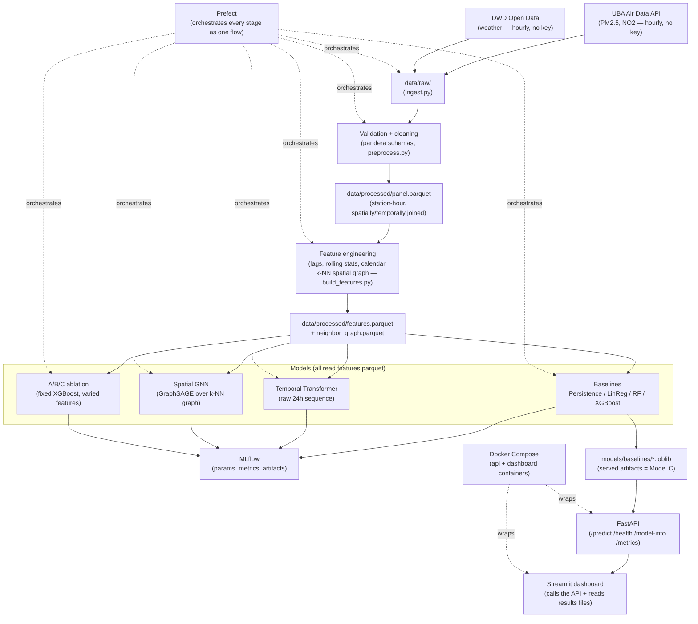

# AirQualityCascade

Germany-focused short-term air-quality forecasting: PM2.5/NO2 forecasts at
**t+1h and t+2h** from UBA (pollution) and DWD (weather) open hourly data.

**Research question:** does spatial information from neighboring stations
improve short-term forecasting over a station's own history and weather
alone?

**Answer** ([Spatial experiment](#spatial-experiment)): yes, measurably — but
*how* you add it matters. A simple neighbor-mean feature beats a 2-layer
GraphSAGE GNN learning the aggregation from scratch, at this dataset's scale.
A specific finding about this GNN/dataset/architecture, not a claim that
GNNs are worse at spatial tasks generally.

> All 11 development phases complete — ingestion, features, models, MLflow,
> Prefect, FastAPI + Streamlit, Docker, CI, all running locally. Every number
> below is measured from this repo's own output files, not invented.


*Real screenshots of the live dashboard: forecast, model comparison, map,
then switching to the hardest station in the test set and its actual
~250 µg/m³ spike history.*

## Data

| Source | What | Resolution | License |
|---|---|---|---|
| [UBA Air Data API v3](https://www.umweltbundesamt.de/api/air_data/v3) | PM2.5, NO2 and other pollutants at German stations | **Hourly** (verified live — no sub-hourly values exist) | Datenlizenz Deutschland – Namensnennung 2.0 |
| [DWD Open Data (CDC)](https://opendata.dwd.de/climate_environment/CDC/observations_germany/climate/) | Temperature, wind, pressure, precipitation, humidity | Hourly | CC BY 4.0 |

No API key required for either. Full field docs:
[`configs/data_sources.yaml`](configs/data_sources.yaml).

**On prediction horizons**: the original brief targeted 30-/60-minute
forecasts. UBA's network only publishes hourly aggregates (confirmed by
querying live data — no finer granularity exists), so interpolating to
synthesize 30-minute points would misrepresent the data. This project
forecasts **t+1h / t+2h** instead — the finest horizon the real data
actually supports.

**Scale** (90-day window, 2026-06-24 → 2026-09-21): 315 PM2.5 stations,
664,791 hourly observations (97.7% of theoretical max), 251/315 stations
have a same-pollutant neighbor within 25km. Full stats:
`data/raw/manifest.json`, reproducible via
[`scripts/ingest.py`](scripts/ingest.py).

Every raw table is [pandera](https://pandera.readthedocs.io/)-validated for
physical plausibility before cleaning
([`schemas.py`](src/aqcascade/validation/schemas.py)) — caught a real bug
where DWD's raw station-level pressure column was mapped instead of
sea-level pressure, producing impossible ~700 hPa readings at high-elevation
stations. Missing values are never silently filled; every `NaN` is carried
forward for feature engineering to handle explicitly.

## Architecture



Only the baseline XGBoost model ("Model C") is served via the API — the
Transformer and GNN exist to answer the research question, not for
production serving, since a single-station prediction request doesn't have
the other 314 stations' simultaneous data a GNN snapshot needs.

## Methodology

**Leakage prevention**: for a prediction at time T, only data at-or-before T
is used; splits are strictly chronological, never random. Guards live in
[`validation/leakage.py`](src/aqcascade/validation/leakage.py) and gate every
split via [`evaluation/split.py`](src/aqcascade/evaluation/split.py).
[`test_feature_leakage.py`](tests/data/test_feature_leakage.py) runs the real
feature-building code on a synthetic panel with a spike planted at a future
hour and asserts no feature sees it early (with a positive control proving
the check isn't vacuous).

**Features** (67 columns, 680,400 rows = 315 stations × 2,160 hours,
[`features.yaml`](configs/features.yaml)): pollution history (lags, rolling
stats, rate-of-change), weather, calendar (cyclically encoded), and spatial
(k=5 nearest same-pollutant neighbors within 100km).

**Models**: Persistence / Linear Regression / Random Forest / XGBoost
baselines; a Temporal Transformer learning directly from a raw 24h sequence
(no neighbor features, no hand-engineered lags); and a Spatial GNN
(2-layer GraphSAGE over the same k-NN graph) that learns spatial aggregation
instead of consuming a pre-computed neighbor summary.

## Results

Test-split metrics, full breakdown in
`data/processed/{baseline,transformer,gnn}_results.csv`:

| Target | Model | MAE | RMSE | R² |
|---|---|--:|--:|--:|
| PM2.5 t+1h | Persistence | **0.723** | 2.130 | 0.453 |
| PM2.5 t+1h | XGBoost | 0.741 | 1.848 | 0.588 |
| PM2.5 t+1h | GNN | 0.873 | 1.859 | 0.582 |
| PM2.5 t+1h | Transformer | 0.848 | **1.835** | **0.618** |
| PM2.5 t+2h | Persistence | 1.106 | 2.555 | 0.210 |
| PM2.5 t+2h | **XGBoost** | **1.036** | **2.073** | **0.480** |
| NO2 t+1h | **XGBoost** | **2.507** | **4.187** | **0.846** |

Persistence has the *lowest* raw MAE at PM2.5 t+1h (most hours barely
change) but the *worst* R² except itself at t+2h (it can't see sharp swings
coming) — both real, not in tension, they measure different things. These
baselines mix local/weather/spatial signal, so they can't say *why* XGBoost
wins — that's the controlled experiment below.

### Spatial experiment

Holds architecture fixed (XGBoost) and varies only feature access, in
strictly nested tiers
([`feature_groups.py`](src/aqcascade/models/feature_groups.py)), plus the
GNN retrained on Model B's exact feature scope for a controlled comparison:

| Target | Model | Features | R² |
|---|---|---|--:|
| PM2.5 t+1h | A — local history only | 54 | 0.541 |
| PM2.5 t+1h | B — A + weather | 63 | 0.560 |
| PM2.5 t+1h | D — B + GNN message passing | 66 | 0.582 |
| PM2.5 t+1h | **C — B + neighbor features** | 69 | **0.588** |
| PM2.5 t+2h | A — local history only | 54 | 0.409 |
| PM2.5 t+2h | B — A + weather | 63 | 0.431 |
| PM2.5 t+2h | D — B + GNN message passing | 66 | 0.447 |
| PM2.5 t+2h | **C — B + neighbor features** | 69 | **0.470** |

R² rises monotonically at every step, both horizons, no reversals — spatial
context is the single largest feature-group contribution measured here. But
the GNN (D), despite learning its own aggregation via message passing,
doesn't catch up to simply handing the model a pre-computed neighbor mean
(C). The ranking A < B < D < C holds on both horizons: message passing
strictly helps over no spatial information at all, it just hasn't closed the
gap to the simpler feature at *this* scale (90 days, 315 stations, a
deliberately simple 2-layer architecture) — not run further for lack of data
to justify a richer architecture.

### Error analysis

Traffic stations are harder to forecast than background stations (mean MAE
0.807 vs 0.722) — burstier, less autocorrelated PM2.5. Per-station MAE
correlates with that station's own outlier rate (r = 0.657). Spike
classification (train-period 90th-percentile threshold): precision 0.71,
recall 0.47 — conservative, usually right when it flags a spike but misses
over half of real ones. Full breakdown:
`data/processed/error_analysis_*.csv`.

## API

FastAPI service ([`src/aqcascade/api/`](src/aqcascade/api/)) serving the
same XGBoost "Model C" artifact evaluated above — verified byte-for-byte
identical in feature composition to the ablation's Model C. Serves from
batch-ingested data, never a live feed; every response carries
`as_of_timestamp`.

```bash
uvicorn aqcascade.api.main:app --port 8010 --app-dir src
curl -X POST http://localhost:8010/predict -H "Content-Type: application/json" \
  -d '{"station_id": 21, "pollutant": "pm25", "horizon_hours": 1}'
# -> {"predicted_value": 5.9, "model_version": "xgboost-model-c__target_pm25_h1",
#     "uncertainty": {"mae": 0.75, "rmse": 1.846, "r2": 0.588}}
```

Unknown `station_id` → `404`; an untrained (pollutant, horizon) combination
→ `422`; malformed requests are rejected by Pydantic before reaching the
model. Also `GET /health`, `/model-info`, `/metrics`, docs at `/docs`.
Tested end-to-end in [`tests/api/test_api.py`](tests/api/test_api.py).

## Dashboard

```bash
uvicorn aqcascade.api.main:app --port 8010 --app-dir src &
PYTHONPATH=src streamlit run app/streamlit/dashboard.py --server.port 8512
```

[`dashboard.py`](app/streamlit/dashboard.py) calls the live API for
forecasts and reads every other number from this project's own output
files: current reading + forecast with a spike alert, 7-day trend,
neighboring-station values, model comparison, per-station error stats, and
a pydeck map — see the GIF above.

## MLOps

**MLflow** — every training script logs params, metrics, a content hash of
the exact feature file used (`dataset_version`), and (for baselines,
Transformer, GNN — not the 6 ablation runs, which compare feature tiers
only) the trained artifact. Verified: **20 runs across 4 experiments**
actually logged. `mlflow ui --backend-store-uri sqlite:///mlruns/mlflow.db`.

**Prefect** — [`pipeline/flows.py`](src/aqcascade/pipeline/flows.py) wraps
the existing scripts as tasks in one flow, each shelling out to the real
script rather than reimplementing it, no server required. Verified with a
real, complete ~27-minute end-to-end run, all tasks `Completed` — the
results throughout this README come from that run.

**Docker** — the image serves the API and dashboard from already-trained
artifacts (never trains) with a trimmed dependency set (no torch/mlflow/
prefect at runtime). Built and run for real: `/health` and `/predict`
verified via `curl` through the container, dashboard verified in-browser
through the container network, matching the non-Docker run exactly. Image
is 1.92GB — larger than ideal, because a version-mismatch bug (a joblib-
pickled XGBoost model loaded under a different XGBoost major version
silently produced a different prediction) means the serving image must
match the training XGBoost version rather than use a slimmer pin.
`docker compose up -d && curl http://localhost:8013/health`.

**CI** — [`ci.yml`](.github/workflows/ci.yml) runs `ruff`, `mypy`, `pytest`
on push/PR; doesn't retrain or hit live APIs. Tests needing real trained
models `skipif` on their absence
([`conftest.py`](tests/conftest.py)) — verified locally (78 passed/13
skipped with `data/`+`models/` hidden, 91 passed restored). Not yet
exercised on a real GitHub Actions runner.

## Reproduction

```bash
# Environment (Python 3.12)
uv venv --python 3.12 && source .venv/bin/activate && uv pip install -e ".[dev]"

python scripts/ingest.py               # writes data/raw/, no API key needed (~5 min)
python scripts/preprocess.py           # validate + clean + join
python scripts/build_features.py       # leakage-safe feature table
python scripts/train_baselines.py      # ~7-14 min
python scripts/train_transformer.py    # ~3 min on Apple Silicon MPS
python scripts/train_gnn.py            # ~1 min on Apple Silicon MPS
python scripts/run_ablation.py         # ~40s
python scripts/error_analysis.py       # ~10s

# --- or run everything after ingestion as one Prefect flow: ---
python -c "from aqcascade.pipeline.flows import full_pipeline; full_pipeline(skip_ingestion=True)"

mlflow ui --backend-store-uri sqlite:///mlruns/mlflow.db   # inspect tracked runs

# Serve directly, or containerized:
uvicorn aqcascade.api.main:app --port 8010 --app-dir src &
PYTHONPATH=src streamlit run app/streamlit/dashboard.py --server.port 8512
docker compose up -d   # api on :8013, dashboard on :8512
```

**macOS**: XGBoost needs the OpenMP runtime — `brew install libomp` before
training, or `pip install xgboost` raises `dlopen ... libomp.dylib` on import.

## Limitations

- Forecasts are **t+1h/t+2h**, not literal 30/60-minute-ahead, and serve batch-ingested data, not a live feed — every response carries `as_of_timestamp`.
- UBA (pollution) and DWD (weather) are different physical networks; weather is a nearest-station join, not co-located. ~15% of DWD precipitation downloads failed despite active metadata.
- This GNN is deliberately simple (2-layer GraphSAGE, single-hour snapshots) and doesn't yet close the gap to simple neighbor-mean features at this scale — see Spatial experiment.
- Spike-classification recall (0.47) is weaker than precision (0.71) — under-flags real spikes more than it over-flags calm periods, a real gap for early-warning use.
- `/predict`'s `uncertainty` field is a historical test-set residual, not a per-prediction confidence interval.
- Model artifacts are joblib-pickled, not safe across XGBoost major versions (verified: a materially different prediction resulted). The real fix, `Booster.save_model`'s portable format, wasn't implemented to avoid retraining scope creep.
- CI has not been exercised on a real GitHub Actions runner yet.

## License

Code: MIT (see [`LICENSE`](LICENSE)). Data: subject to the UBA and DWD
licenses listed above — this repo does not redistribute raw data.
